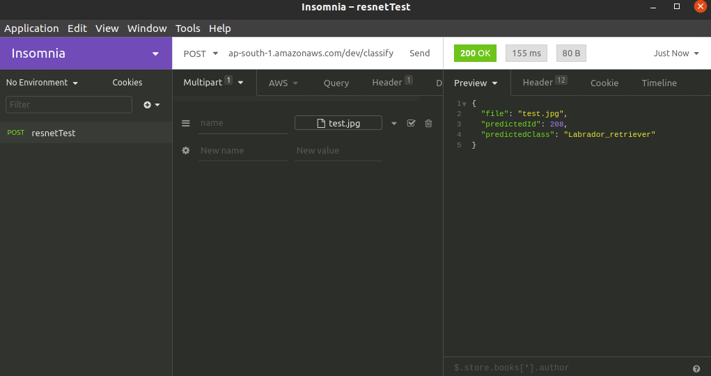

# Session1: Deploying to AWS

## Project Statement:  
Deploy pretrained [MobileNet-V2](https://pytorch.org/hub/pytorch_vision_mobilenet_v2/) model to AWS. Test deployment on [this](https://s3.amazonaws.com/cdn-origin-etr.akc.org/wp-content/uploads/2019/12/03202400/Yellow-Labrador-Retriever.jpg) test image.


## Demo
### Input Image


### Test Screenshot


### Endpoint URL
URL: [https://3njah24gii.execute-api.ap-south-1.amazonaws.com/dev/classify]( https://3njah24gii.execute-api.ap-south-1.amazonaws.com/dev/classify)


----------
## Under The Hood

### What exactly is Happening ?

(Source TSAI)

### Steps Followed

- Install Node and NPM

```bash
curl -sL https://deb.nodesource.com/setup_10.x -o nodesource_setup.sh
sudo bash nodesource_setup.sh
sudo apt-get install -y nodejs
```

- Install serverless

```bash
sudo npm install -g serverless
```

- Configure AWS  
  1. Sign in to your AWS Console
  2. Create a new user for programmatic access. Select IAM (Identity and Access Management)
  3. For permissions,select AdministratorAccess 
  4. Notedown/Download key and secret 


- Setup serverless

```bash
sls config credentials --provider aws --key **** --secret **** --overwrite
```

- Install anaconda from https://docs.anaconda.com/anaconda/install/linux/

- Create a new environment in Anaconda

```bash
conda create --name pytorch-env
conda activate pytorch-env
```

- Download Pretrained mobilenetv2 model

```python
>>> import torch
>>> model = torch.hub.load('pytorch/vision:v0.6.0', 'mobilenet_v2', pretrained=True)
>>> traced_model = torch.jit.trace(model, torch.randn(1, 3, 224, 224))
>>> traced_model.save('mobilenetv2.pt')
```

- Upload saved model to AWS S3 bucket

- Use the template to create a new project

```bash
sls create --template aws-python3 --name mobilenet-pytorch-example
```

- Install serverless plugin to created package

```bash
cd mobilenet-pytorch-example
sls plugin install -n serverless-python-requirements
```

- Edit files ['handler.py'](https://github.com/chirag2saraiya/TSAI-DeepVision-EVA4/blob/master/mobilenet-pytorch-example/handler.py)',
['serverless.yml'](https://github.com/chirag2saraiya/TSAI-DeepVision-EVA4/blob/master/mobilenet-pytorch-example/serverless.yml) and ['package.json'](https://github.com/chirag2saraiya/TSAI-DeepVision-EVA4/blob/master/mobilenet-pytorch-example/package.json)

- Deploy 

```bash
npm run deploy
```


- Add Binary Media Types in Amazon API Gateway Settings

```txt
multipart/form-data
*/*
```
- Test endpoint using [Insomnia](https://insomnia.rest/download/)

### Endpoint URL
URL: [https://3njah24gii.execute-api.ap-south-1.amazonaws.com/dev/classify](https://3njah24gii.execute-api.ap-south-1.amazonaws.com/dev/classify)

Used Insomnia(https://insomnia.rest/download/) to query Endpoint as shown in Demo.

### References 
TSAI and https://towardsdatascience.com/scaling-machine-learning-from-zero-to-hero-d63796442526
