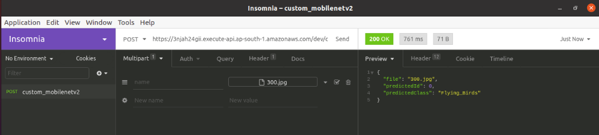

# Session1: MobileNets And Shufflenets

## Project Statement:  
Use pre trained [MobileNet-V2](https://pytorch.org/hub/pytorch_vision_mobilenet_v2/) model on custom dataset (4 classes Flying Birds, Large Quadcopters, Small Quadcopters and Winged Drones) and deploy it to AWS using serverless lamda architecture. 

## Demo
### Input Image

### Test Screenshot

### Endpoint URL
URL: [https://v1agl77crf.execute-api.ap-south-1.amazonaws.com/dev/classify](https://v1agl77crf.execute-api.ap-south-1.amazonaws.com/dev/classify)

----------
## Under The Hood

### Module Brief:
Project is divided in to following modules

- utils (contains utility)

  split_data     -> Contains python package to split data into training and test data, as per partition size as input.
  
  transform      -> Contains DataClass, which is having functions to operate on Image data.
                    Function for Image transform , getting Dataloader, Displaying Image data, Displaying statistics for number of images in each class.
                    
  model_analysis -> Contains functions for plotting Traing and Test accuracy statistics, and for displaying missclassified images for individual class.

- model (contains model related modules)

  model          -> Contains generalise functions to download pre trained model as per model name, also contains getting optimizer and schedular functions.
  
  train          -> Contains function for training model for number of epoch as input, along with optimizer schedular etc as other required inputs.

- Sessionp2s2_MobileNetV2.ipynb  -> Colab file to run above modules in sequential format. 

### Resizing Strategy
The dataset has been collected from various sources on the internet hence it had variety of sizes. Also it was observed that there was variety in type of image files as well and many images were corrupted or not images at all. Thus we first manually cleaned the dataset and resized it to 300x300 jpeg images. During this process we removed all the corrupted and unsuitable images. After resizing we uploaded the dataset to google drive and utilized the same for training.

Since we are using pretrained MobileNetV2 model as base we must have 224x224 as input image size. Hence during the training we followed below mentioned resizing and augmentation strategy.  
1. Random resize and crop to 256x256
2. Random rotation +/- 15 Degrees
3. Random color Jitter
4. Random Horizontal flips
5. Center Crop to 224x224

### The Model
PyTorch has many pretrained models we can use. All of these models have been trained on Imagenet which consists of millions of images across 1000 categories. What we want to do with pretrained models is freeze the early layers, and replace the classification module with our own.

### Note: In this Project we are using mobilenet_v2 pretrained model

# Approach
The approach for using a pre-trained image recognition model :

1. Load in pre-trained weights from a network trained on a large dataset
2. Freeze all the weights in the lower (convolutional) layers
3. Replace the classifier (fully connected) part of the network with a custom classifier
    * Here we have added 2 fully connected layers (1048 to 256 and 256 to 4) in between last layer and final classifier output
      * This strategy is used , since we thought It would be better to have one hop of extra layer to avoid directly reducing number of nodes from 1048 to 4.
    * Number of outputs must be set equal to the number of classes
4. Train only the custom classifier (fully connected) layers for the task
  
The idea behind pre-training is the early convolutional layers of a cnn extract features that are relevant for many image recognition tasks. The later, fully-connected layers, specialize to the specific dataset by learning higher-level features. Therefore, we can use the already trained convolutional layers while training only the fully-connected layers on our own dataset. Pre-trained networks have proven to be reasonably successful for a variety of tasks, and result in a significant reduction in training time and usually increases in performance.

### Training Analysis

### Missclassified Images  
- Flying Birds

- Large QuadCopter

- Small QuadCopter

- Winged Drones

### Endpoint URL
URL: [https://v1agl77crf.execute-api.ap-south-1.amazonaws.com/dev/classify](https://v1agl77crf.execute-api.ap-south-1.amazonaws.com/dev/classify)

Used [Insomnia](https://insomnia.rest/download/) to query Endpoint as shown in Demo.

### References 
TSAI and https://towardsdatascience.com/scaling-machine-learning-from-zero-to-hero-d63796442526
