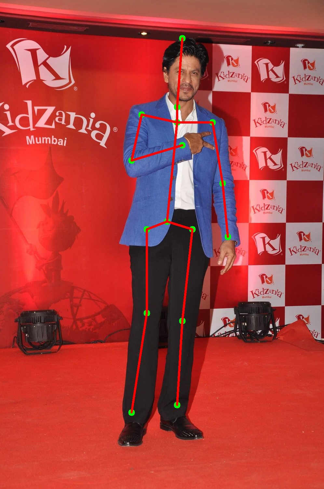

# Static Website
http://www.ai-genie.com.s3-website.ap-south-1.amazonaws.com/

# Simple Baselines for Human Pose Estimation and Tracking

We have reffered [Simple Baseline for HPE and tracking ](https://github.com/Microsoft/human-pose-estimation.pytorch) blog and [Paper](https://arxiv.org/pdf/1804.06208.pdf) 

- As other approaches have become complex,this work aimed to ease the problem by asking a question, "how good could a simple method be?" 
- This approach involves a few deconvolutional layers added on a backbone network, ResNet. 


- This approach adds a few deconvolutional layers over the last convolution stage in the ResNet, called C5.
- They adopted this structure because it is arguably the simplest to generate heatmaps from deep and low resolution features and also adopted in the state-of-the-art Mask R-CNN
- By default, three deconvolutional layers with batch normalization and ReLU activation are used. Each layer has 256 filters with 4 × 4 kernel. The stride is 2.    A 1 × 1 convolutional layer is added at last to generate predicted heatmaps {H1 . . . Hk} for all k key points.

```
summary(model,(3,256,256))

----------------------------------------------------------------
        Layer (type)               Output Shape         Param #
================================================================
            Conv2d-1         [-1, 64, 128, 128]           9,408
       BatchNorm2d-2         [-1, 64, 128, 128]             128
              ReLU-3         [-1, 64, 128, 128]               0
         MaxPool2d-4           [-1, 64, 64, 64]               0
            Conv2d-5           [-1, 64, 64, 64]           4,096
       BatchNorm2d-6           [-1, 64, 64, 64]             128
              ReLU-7           [-1, 64, 64, 64]               0
            Conv2d-8           [-1, 64, 64, 64]          36,864
       BatchNorm2d-9           [-1, 64, 64, 64]             128
             ReLU-10           [-1, 64, 64, 64]               0
           Conv2d-11          [-1, 256, 64, 64]          16,384
      BatchNorm2d-12          [-1, 256, 64, 64]             512
           Conv2d-13          [-1, 256, 64, 64]          16,384
      BatchNorm2d-14          [-1, 256, 64, 64]             512
             ReLU-15          [-1, 256, 64, 64]               0
       Bottleneck-16          [-1, 256, 64, 64]               0
           Conv2d-17           [-1, 64, 64, 64]          16,384
      BatchNorm2d-18           [-1, 64, 64, 64]             128
             ReLU-19           [-1, 64, 64, 64]               0
           Conv2d-20           [-1, 64, 64, 64]          36,864
      BatchNorm2d-21           [-1, 64, 64, 64]             128
             ReLU-22           [-1, 64, 64, 64]               0
           Conv2d-23          [-1, 256, 64, 64]          16,384
      BatchNorm2d-24          [-1, 256, 64, 64]             512
             ReLU-25          [-1, 256, 64, 64]               0
       Bottleneck-26          [-1, 256, 64, 64]               0
           Conv2d-27           [-1, 64, 64, 64]          16,384
      BatchNorm2d-28           [-1, 64, 64, 64]             128
             ReLU-29           [-1, 64, 64, 64]               0
           Conv2d-30           [-1, 64, 64, 64]          36,864
      BatchNorm2d-31           [-1, 64, 64, 64]             128
             ReLU-32           [-1, 64, 64, 64]               0
           Conv2d-33          [-1, 256, 64, 64]          16,384
      BatchNorm2d-34          [-1, 256, 64, 64]             512
             ReLU-35          [-1, 256, 64, 64]               0
       Bottleneck-36          [-1, 256, 64, 64]               0
           Conv2d-37          [-1, 128, 64, 64]          32,768
      BatchNorm2d-38          [-1, 128, 64, 64]             256
             ReLU-39          [-1, 128, 64, 64]               0
           Conv2d-40          [-1, 128, 32, 32]         147,456
      BatchNorm2d-41          [-1, 128, 32, 32]             256
             ReLU-42          [-1, 128, 32, 32]               0
           Conv2d-43          [-1, 512, 32, 32]          65,536
      BatchNorm2d-44          [-1, 512, 32, 32]           1,024
           Conv2d-45          [-1, 512, 32, 32]         131,072
      BatchNorm2d-46          [-1, 512, 32, 32]           1,024
             ReLU-47          [-1, 512, 32, 32]               0
       Bottleneck-48          [-1, 512, 32, 32]               0
           Conv2d-49          [-1, 128, 32, 32]          65,536
      BatchNorm2d-50          [-1, 128, 32, 32]             256
             ReLU-51          [-1, 128, 32, 32]               0
           Conv2d-52          [-1, 128, 32, 32]         147,456
      BatchNorm2d-53          [-1, 128, 32, 32]             256
             ReLU-54          [-1, 128, 32, 32]               0
           Conv2d-55          [-1, 512, 32, 32]          65,536
      BatchNorm2d-56          [-1, 512, 32, 32]           1,024
             ReLU-57          [-1, 512, 32, 32]               0
       Bottleneck-58          [-1, 512, 32, 32]               0
           Conv2d-59          [-1, 128, 32, 32]          65,536
      BatchNorm2d-60          [-1, 128, 32, 32]             256
             ReLU-61          [-1, 128, 32, 32]               0
           Conv2d-62          [-1, 128, 32, 32]         147,456
      BatchNorm2d-63          [-1, 128, 32, 32]             256
             ReLU-64          [-1, 128, 32, 32]               0
           Conv2d-65          [-1, 512, 32, 32]          65,536
      BatchNorm2d-66          [-1, 512, 32, 32]           1,024
             ReLU-67          [-1, 512, 32, 32]               0
       Bottleneck-68          [-1, 512, 32, 32]               0
           Conv2d-69          [-1, 128, 32, 32]          65,536
      BatchNorm2d-70          [-1, 128, 32, 32]             256
             ReLU-71          [-1, 128, 32, 32]               0
           Conv2d-72          [-1, 128, 32, 32]         147,456
      BatchNorm2d-73          [-1, 128, 32, 32]             256
             ReLU-74          [-1, 128, 32, 32]               0
           Conv2d-75          [-1, 512, 32, 32]          65,536
      BatchNorm2d-76          [-1, 512, 32, 32]           1,024
             ReLU-77          [-1, 512, 32, 32]               0
       Bottleneck-78          [-1, 512, 32, 32]               0
           Conv2d-79          [-1, 256, 32, 32]         131,072
      BatchNorm2d-80          [-1, 256, 32, 32]             512
             ReLU-81          [-1, 256, 32, 32]               0
           Conv2d-82          [-1, 256, 16, 16]         589,824
      BatchNorm2d-83          [-1, 256, 16, 16]             512
             ReLU-84          [-1, 256, 16, 16]               0
           Conv2d-85         [-1, 1024, 16, 16]         262,144
      BatchNorm2d-86         [-1, 1024, 16, 16]           2,048
           Conv2d-87         [-1, 1024, 16, 16]         524,288
      BatchNorm2d-88         [-1, 1024, 16, 16]           2,048
             ReLU-89         [-1, 1024, 16, 16]               0
       Bottleneck-90         [-1, 1024, 16, 16]               0
           Conv2d-91          [-1, 256, 16, 16]         262,144
      BatchNorm2d-92          [-1, 256, 16, 16]             512
             ReLU-93          [-1, 256, 16, 16]               0
           Conv2d-94          [-1, 256, 16, 16]         589,824
      BatchNorm2d-95          [-1, 256, 16, 16]             512
             ReLU-96          [-1, 256, 16, 16]               0
           Conv2d-97         [-1, 1024, 16, 16]         262,144
      BatchNorm2d-98         [-1, 1024, 16, 16]           2,048
             ReLU-99         [-1, 1024, 16, 16]               0
      Bottleneck-100         [-1, 1024, 16, 16]               0
          Conv2d-101          [-1, 256, 16, 16]         262,144
     BatchNorm2d-102          [-1, 256, 16, 16]             512
            ReLU-103          [-1, 256, 16, 16]               0
          Conv2d-104          [-1, 256, 16, 16]         589,824
     BatchNorm2d-105          [-1, 256, 16, 16]             512
            ReLU-106          [-1, 256, 16, 16]               0
          Conv2d-107         [-1, 1024, 16, 16]         262,144
     BatchNorm2d-108         [-1, 1024, 16, 16]           2,048
            ReLU-109         [-1, 1024, 16, 16]               0
      Bottleneck-110         [-1, 1024, 16, 16]               0
          Conv2d-111          [-1, 256, 16, 16]         262,144
     BatchNorm2d-112          [-1, 256, 16, 16]             512
            ReLU-113          [-1, 256, 16, 16]               0
          Conv2d-114          [-1, 256, 16, 16]         589,824
     BatchNorm2d-115          [-1, 256, 16, 16]             512
            ReLU-116          [-1, 256, 16, 16]               0
          Conv2d-117         [-1, 1024, 16, 16]         262,144
     BatchNorm2d-118         [-1, 1024, 16, 16]           2,048
            ReLU-119         [-1, 1024, 16, 16]               0
      Bottleneck-120         [-1, 1024, 16, 16]               0
          Conv2d-121          [-1, 256, 16, 16]         262,144
     BatchNorm2d-122          [-1, 256, 16, 16]             512
            ReLU-123          [-1, 256, 16, 16]               0
          Conv2d-124          [-1, 256, 16, 16]         589,824
     BatchNorm2d-125          [-1, 256, 16, 16]             512
            ReLU-126          [-1, 256, 16, 16]               0
          Conv2d-127         [-1, 1024, 16, 16]         262,144
     BatchNorm2d-128         [-1, 1024, 16, 16]           2,048
            ReLU-129         [-1, 1024, 16, 16]               0
      Bottleneck-130         [-1, 1024, 16, 16]               0
          Conv2d-131          [-1, 256, 16, 16]         262,144
     BatchNorm2d-132          [-1, 256, 16, 16]             512
            ReLU-133          [-1, 256, 16, 16]               0
          Conv2d-134          [-1, 256, 16, 16]         589,824
     BatchNorm2d-135          [-1, 256, 16, 16]             512
            ReLU-136          [-1, 256, 16, 16]               0
          Conv2d-137         [-1, 1024, 16, 16]         262,144
     BatchNorm2d-138         [-1, 1024, 16, 16]           2,048
            ReLU-139         [-1, 1024, 16, 16]               0
      Bottleneck-140         [-1, 1024, 16, 16]               0
          Conv2d-141          [-1, 512, 16, 16]         524,288
     BatchNorm2d-142          [-1, 512, 16, 16]           1,024
            ReLU-143          [-1, 512, 16, 16]               0
          Conv2d-144            [-1, 512, 8, 8]       2,359,296
     BatchNorm2d-145            [-1, 512, 8, 8]           1,024
            ReLU-146            [-1, 512, 8, 8]               0
          Conv2d-147           [-1, 2048, 8, 8]       1,048,576
     BatchNorm2d-148           [-1, 2048, 8, 8]           4,096
          Conv2d-149           [-1, 2048, 8, 8]       2,097,152
     BatchNorm2d-150           [-1, 2048, 8, 8]           4,096
            ReLU-151           [-1, 2048, 8, 8]               0
      Bottleneck-152           [-1, 2048, 8, 8]               0
          Conv2d-153            [-1, 512, 8, 8]       1,048,576
     BatchNorm2d-154            [-1, 512, 8, 8]           1,024
            ReLU-155            [-1, 512, 8, 8]               0
          Conv2d-156            [-1, 512, 8, 8]       2,359,296
     BatchNorm2d-157            [-1, 512, 8, 8]           1,024
            ReLU-158            [-1, 512, 8, 8]               0
          Conv2d-159           [-1, 2048, 8, 8]       1,048,576
     BatchNorm2d-160           [-1, 2048, 8, 8]           4,096
            ReLU-161           [-1, 2048, 8, 8]               0
      Bottleneck-162           [-1, 2048, 8, 8]               0
          Conv2d-163            [-1, 512, 8, 8]       1,048,576
     BatchNorm2d-164            [-1, 512, 8, 8]           1,024
            ReLU-165            [-1, 512, 8, 8]               0
          Conv2d-166            [-1, 512, 8, 8]       2,359,296
     BatchNorm2d-167            [-1, 512, 8, 8]           1,024
            ReLU-168            [-1, 512, 8, 8]               0
          Conv2d-169           [-1, 2048, 8, 8]       1,048,576
     BatchNorm2d-170           [-1, 2048, 8, 8]           4,096
            ReLU-171           [-1, 2048, 8, 8]               0
      Bottleneck-172           [-1, 2048, 8, 8]               0
 ConvTranspose2d-173          [-1, 256, 16, 16]       8,388,608
     BatchNorm2d-174          [-1, 256, 16, 16]             512
            ReLU-175          [-1, 256, 16, 16]               0
 ConvTranspose2d-176          [-1, 256, 32, 32]       1,048,576
     BatchNorm2d-177          [-1, 256, 32, 32]             512
            ReLU-178          [-1, 256, 32, 32]               0
 ConvTranspose2d-179          [-1, 256, 64, 64]       1,048,576
     BatchNorm2d-180          [-1, 256, 64, 64]             512
            ReLU-181          [-1, 256, 64, 64]               0
          Conv2d-182           [-1, 16, 64, 64]           4,112
================================================================
Total params: 33,999,440
Trainable params: 33,999,440
Non-trainable params: 0
----------------------------------------------------------------
Input size (MB): 0.75
Forward/backward pass size (MB): 406.25
Params size (MB): 129.70
Estimated Total Size (MB): 536.70
----------------------------------------------------------------
```

### JointsMSELoss
- Mean Squared Error (MSE) is used as the loss between the predicted heatmaps and targeted heatmaps. The targeted heatmap Hˆk for joint k is generated by applying a 2D gaussian centered on the kth joint’s ground truth location.

### Input 

### Output


# Converting to ONNX
- What is ONNX ?

ONNX is an open format built to represent machine learning models. ONNX defines a common set of operators — the building blocks of machine learning and deep learning models - and a common file format to enable AI developers to use models with a variety of frameworks, tools, runtimes, and compilers.


Install onnx and onnxruntime.
```
! pip install onnx onnxruntime

```
We have followed [onnx](https://pytorch.org/tutorials/advanced/super_resolution_with_onnxruntime.html) pytorch example.

Refer to [implementation](https://github.com/chirag2saraiya/TSAI-DeepVision-EVA4/blob/master/05-Human-Pose-Estimation/S5_Human_Pose_Estimation.ipynb)


#### References  
- Simple Baselines for Human Pose Estimation and Tracking [code](https://github.com/microsoft/human-pose-estimation.pytorch) & [paper](https://arxiv.org/abs/1804.06208)
- [Converting PIL images to bytes](https://jdhao.github.io/2019/07/06/python_opencv_pil_image_to_bytes/)
-  https://pytorch.org/tutorials/advanced/super_resolution_with_onnxruntime.html
