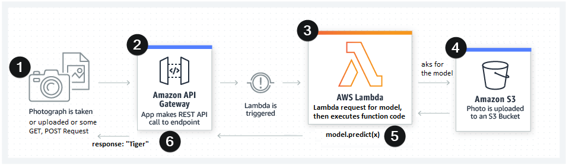

# Deploying to AWS


## Demo
### Input Image


### Screen shot


### Endpoint URL
URL: [ https://7axvk27op0.execute-api.ap-south-1.amazonaws.com/dev/classify]( https://7axvk27op0.execute-api.ap-south-1.amazonaws.com/dev/classify)

### What exactly is Happening ?

(Source TSAI)

## Instructions and Steps

Install Node and NPM

```bash
curl -sL https://deb.nodesource.com/setup_10.x -o nodesource_setup.sh
sudo bash nodesource_setup.sh
sudo apt-get install -y nodejs
```

Install serverless

```bash
sudo npm install -g serverless
```

Configuring AWS
1. Sign in to your AWS Console
2. Create a new user for programmatic access. Select IAM (Identity and Access Management)
3. For permissions,select AdministratorAccess 
4. Notedown/Download key and secret 


Setup serverless

```bash
sudo chown -R $USER:$(id -gn $USER) /home/shadowleaf/.config
sls config credentials --provider aws --key **** --secret **** --overwrite
```

Use the template to create a new project

```bash
sls create --template aws-python3 --name mobilenet-pytorch-example
```


Install anaconda from https://docs.anaconda.com/anaconda/install/linux/

Create a new environment in Anaconda

```bash
conda create --name pytorch-env
conda activate pytorch-env
```

```bash
sls plugin install -n serverless-python-requirements
```

Downloading Pretrained mobilenetv2 model

```python
>>> import torch
>>> model = torch.hub.load('pytorch/vision:v0.6.0', 'mobilenet_v2', pretrained=True)
>>> traced_model = torch.jit.trace(model, torch.randn(1, 3, 224, 224))
>>> traced_model.save('mobilenetv2.pt')
```

Add Binary Media Types in Amazon API Gateway Settings

```txt
multipart/form-data
*/*
```

Deploy 

```bash
npm run deploy
```
### Endpoint URL
URL: [ https://7axvk27op0.execute-api.ap-south-1.amazonaws.com/dev/classify]( https://7axvk27op0.execute-api.ap-south-1.amazonaws.com/dev/classify)

Used Insomnia(https://insomnia.rest/download/) to query Endpoint as shown in Demo.

